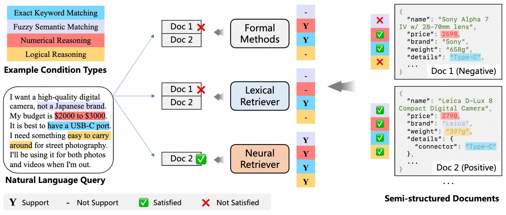
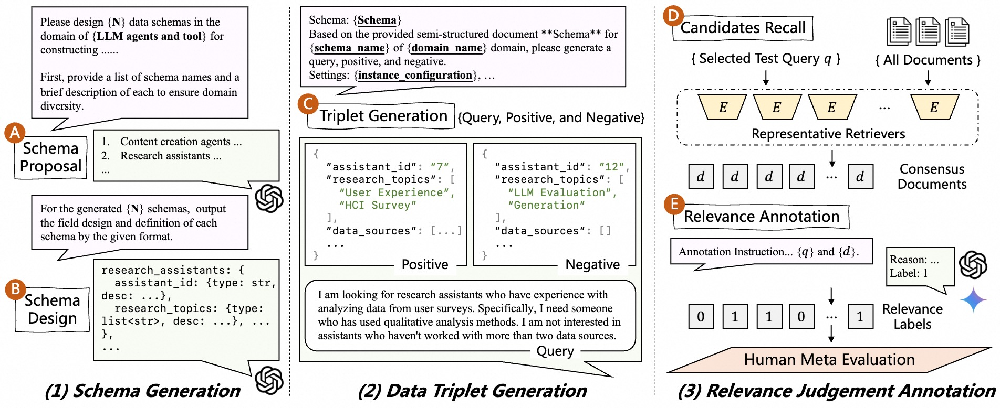

<div align="center">
<h1>SSRB: Direct Natural Language Querying to Massive Heterogeneous Semi-Structured Data</h1> 
</div>

<p align="center">
<!-- <a href="https://arxiv.org/abs/2502.12799">
  </a>  -->
<a href="https://opensource.org/license/mit">
  </a> 
<a href="https://github.com/vec-ai/struct-ir/pulls">
    </a>
</p>


## Introduction
We evaluate the capabilities of current neural retrievers in understanding complex NL queries and semi-structured data.
The queries involve diverse types of filtering conditions for structured objects, including exact and semantic matching, numerical and logical reasoning, or comprehensive understanding of multiple fields.
The document structure can be dynamic, with potential missing fields and flexible structures (nested lists or dictionaries), making it challenging to query using fixed-schema database indexing.
Current powerful LLM-based neural retrievers show promise in providing a unified solution to address the challenges present in this scenario.

</a>

We present the Semi-Structured Retrieval Benchmark (**SSRB**), encompassing 6 domains with 99 different data schemas, totaling 14M data objects, along with 8,485 NL queries of varying difficulty levels.
Given the scarcity of public data, we build **SSRB** by LLMs in a three-stage data synthesis workflow (figure bellow):
(1) schema generation, creating multiple schema definitions for six manually defined domains;
(2) data triples generation, synthesizing $<query, positive, negative>$ triples for each schema using different query characteristic configurations to ensure diversity and quality;
and (3) testset annotation, employing powerful LLMs to judge the relevance recalled candidates to queries as test labels.

</a>

Based on **SSRB**, we evaluate two main types of dense retrievers: 1) small-scale encoder-based models like InstructOR and BGE, and 2) LLM-based ones such as E5-mistral.
We also include the BM25 lexical retriever for comparison.
Our experiments reveal several key findings:
1) BM25 struggle with this task,
2) encoder-based models, benefiting from BERT-style backbones, provide better performance than BM25,
3) LLM-based retrievers achieve notably better performance, highlighting the importance of LLM's powerful semantic understanding and reasoning capabilities in handling complex queries.

However, their absolute performance remains relatively low, indicating the necessity for developing more task-specific retrievers.

## How to run

### 0 Clone this repo

```bash
git clone https://github.com/vec-ai/struct-ir.git
cd ./struct-ir
```

### 1 Download data and models

Download data
```bash
bash ./scripts/hfd.sh --dataset vec-ai/struct-ir
mv struct-ir data
```

Download models
```bash
mkdir models
cd models
bash ../scripts/dl_models.sh
```

### 2 Run selected models

General environments:
```bash
pip install torch transformers 
```

Supported model list:
 - bge
 - instructor
 - jina3
 - nomic2
 - drama
 - e5mistral
 - qwen (gte-qwen2-7b)
 - gritlm
 - nvembedv2


Run one model:
```bash
MODEL_DIR="./models" python evaluate.py --model_name drama --batch_size 32
```

Get results table:
```bash
python ./scripts/print_tables.py
```


## Acknowledgments

TODO
